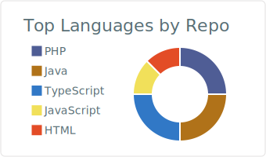
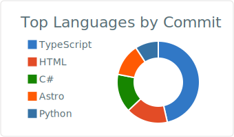
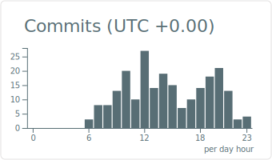

<!-- Header banner -->

  

<!-- Typing SVG -->

  

### whoami

Full-stack engineer. I like clean APIs, fast UIs, and tools that make the
boring parts disappear. Currently deep in the Next.js + React ecosystem,
occasionally venturing into LLM tooling and design systems.

---

### stack

  

---

### projects

**[lagsync-website](https://github.com/kimonsodu/lagsync-website)** &nbsp;·&nbsp; marketing site for the LagSync browser extension &nbsp; 

**[LANBuddies](https://github.com/kimonsodu/LANBuddies)** &nbsp;·&nbsp; local-network multiplayer companion app &nbsp; 

**[voice-controlled-lighting](https://github.com/kimonsodu/voice-controlled-lighting)** &nbsp;·&nbsp; voice-driven smart lighting controller &nbsp; 

---

### stats

  
  

  

  

  Enable <strong>Private contributions</strong> in your GitHub profile settings to include private activity in this streak card.

---

### contribution snake

  

---

  

