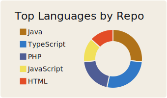
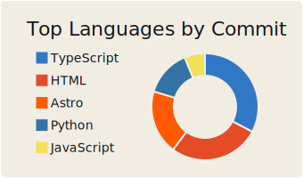
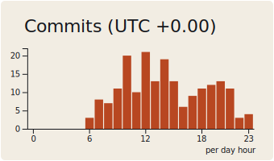

<!-- Header banner -->

  

<!-- Typing SVG -->

  

### whoami

B.Sc. in Computer &amp; Systems Science, Stockholm University (Jan 2026).
Open to roles in **systems**, **fullstack**, **backend**, and **test**
development. I build robust scalable systems — APIs, integrations,
databases — and ship with agile teams.

**Working stack:** Java / Spring Boot · Python · React / TypeScript · REST · MariaDB · OAuth 2.0 · Jenkins CI/CD

---

### stack

  

---

### projects

**[lagsync-website](https://github.com/kimonsodu/lagsync-website)** &nbsp;·&nbsp; marketing site for the LagSync browser extension &nbsp; 

**[LANBuddies](https://github.com/kimonsodu/LANBuddies)** &nbsp;·&nbsp; local-network multiplayer companion app &nbsp; 

**[voice-controlled-lighting](https://github.com/kimonsodu/voice-controlled-lighting)** &nbsp;·&nbsp; voice-driven smart lighting controller &nbsp; 

---

### stats

  
  

  

  

---

### contribution snake

  <picture>
    <source media="(prefers-color-scheme: dark)" srcset="https://raw.githubusercontent.com/kimonsodu/kimonsodu/output/github-contribution-grid-snake-dark.svg"/>
    <source media="(prefers-color-scheme: light)" srcset="https://raw.githubusercontent.com/kimonsodu/kimonsodu/output/github-contribution-grid-snake.svg"/>
    
  </picture>

---

  

