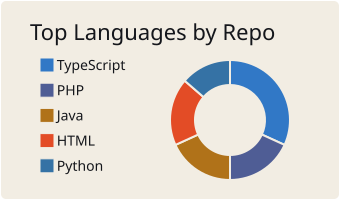
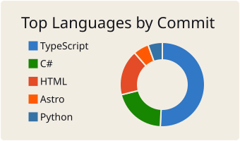
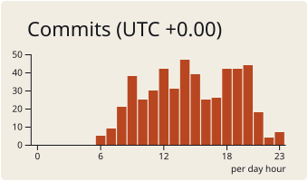

<!-- Header banner -->

  

<!-- Typing SVG -->

  

### whoami

B.Sc. in Computer &amp; Systems Science, Stockholm University (Jan 2026).
I work across the whole stack — front end, back end and data — and I ship
complete products on my own: a browser extension with **1,500+ users** across
five stores, a live SaaS with Stripe billing, and native Windows and Android
apps. Open to **fullstack**, **backend**, **systems** and **test** roles.

**Working stack:** TypeScript · Angular · React / Next.js · Astro · Node · Python · Java / Spring Boot · C# / .NET · Kotlin · REST · Supabase / Postgres / MariaDB · OAuth 2.0 · Stripe · Docker Compose · CI/CD

---

### stack

  

---

### projects

Shipped, live — source private:

**[KeepWinning](https://keepwinning.ai)** &nbsp;·&nbsp; SaaS screening ~5,700 global tickers, with an agentic assistant on the Claude API &nbsp;   

**[Orbital](https://wroughtery.com/orbital)** &nbsp;·&nbsp; motion-sickness relief overlay — Windows app live, Android companion in closed testing &nbsp;  

**[LagSync](https://lagsync.com)** &nbsp;·&nbsp; Bluetooth audio-sync extension, 1,500+ users across five stores &nbsp;·&nbsp; site source: [lagsync-website](https://github.com/kimonsodu/lagsync-website) &nbsp;  

**[Wroughtery](https://wroughtery.com)** &nbsp;·&nbsp; studio site &amp; design system for the tools above &nbsp; 

**[simon.kodu.se](https://simon.kodu.se)** &nbsp;·&nbsp; portfolio, with Lighthouse CI and Playwright gating every deploy &nbsp; 

Public code:

**[LANBuddies](https://github.com/kimonsodu/LANBuddies)** &nbsp;·&nbsp; event &amp; tournament platform built by a team of eight — I took the Spring Boot back end and OAuth 2.0 &nbsp;  

**[voice-controlled-lighting](https://github.com/kimonsodu/voice-controlled-lighting)** &nbsp;·&nbsp; voice-driven multi-room smart lighting over the LIFX API &nbsp; 

---

### stats

  
  

  

  

---

  

